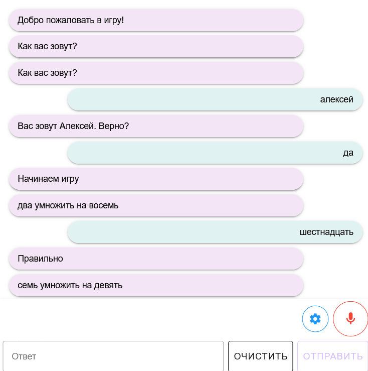

# SpeechWebGame
This project demonstrates how you can capture microphone audio from client web browser, then recognize it on the server, then synthsize speech and send it back to client.

It uses C# for server and Vue.JS for frontend.

For example it shows calculation game.

Этот проект демонстрирует как можно получить аудио запись из браузера клиента, распознать речь на сервере, синтезировать ответ и отправить клиенту обратно.

Для примера показана игра в таблицу умножения.

